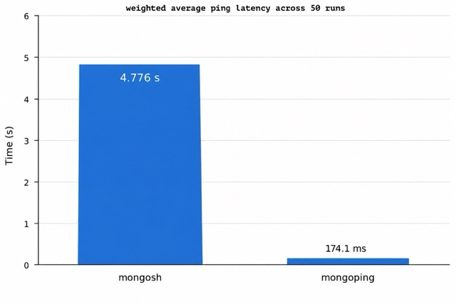
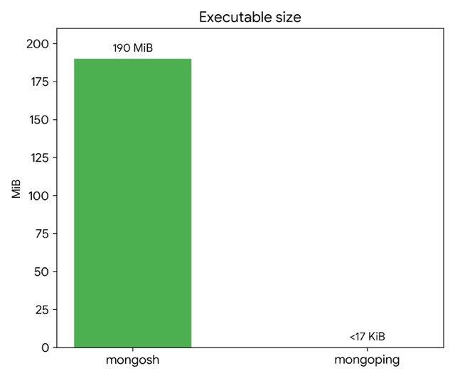
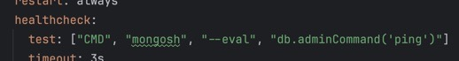
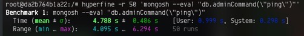
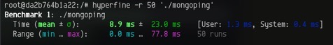

# `mongoping` - the fastest (and smallest) MongoDB ping utility

### Picture for attracting attention
|avg ping latency|exec size
---|--
||
(more about the testing procedure [here](#performance-assessment))

## Motivation

You've probably seen this before:



This is something we all instruct the deployment/orchestration system to use for a periodic health check of a MongoDB 
service. Ever wondered why it could take **seconds** to complete on constrained systems or under heavy load?  
`mongosh` has been developed for much more complex purpose: to give you powerful shell for interacting with Mongo, the 
fact it also can execute *ping* doesn't mean it's the best tool for the job. `mongosh` is **huge**, its executable
is **about 190 MiB** in `mongo:8` image. For constrained systems it might be a pain to call such a big tool, 
especially if your `interval` timings are tighter than the default ones.

## Performance assessment
Testing rig:  
Host system: `2-core Intel Xeon 2.1GHz 4GB RAM` (idle)  
Image: `mongo:8`  
With the following container restrictions:
```yaml
    deploy:
      resources:
        limits:
          cpus: '0.3'
          memory: 1G
        reservations:
          cpus: '0.1'
          memory: 512M
```
Testing commands that were used for the chart slide:  
(the ones inside '' are actual commands executed by Docker when it performs health check)
```shell
hyperfine -r 50 'docker exec mongo mongosh --eval "db.adminCommand(\"ping\")"'
hyperfine -r 50 'docker exec mongo ./mongoping'
```
Docker exec gives enough overhead that you can't assess the actual tool performance. So let's do it inside the container!  
```shell
hyperfine -r 50 'mongosh --eval "db.adminCommand(\"ping\")"'
hyperfine -r 50 './mongoping'
```

  

## Why it is so fast?

The goal was to create smallest possible program which sends the *ping* command and roughly interprets the received 
result as "okay" or "not okay". So ended up with a C program which sends exactly 51 necessary bytes required by the
protocol to be interpreted correctly as a *ping* command. The command is low-level for the server, you don't need
handshake connection. You don't also need to fully decode the resulting BSON to confirm that at least we've got a
meaningful response.

## Usage

Download:
```shell
wget https://github.com/ualinker/mongoping/releases/latest/download/mongoping
chmod +x mongoping
```
Use:
```shell
# for default 127.0.0.1:27017
./mongoping
# or specify your own
./mongoping <HOST> <PORT>
```
If *ping* was a success you'll get 0 exit code and `ok` in STDOUT. Otherwise you get one of these exit codes:

| exit code | interpretation                                            
-----------|-----------------------------------------------------------
| 1         | usage / arg error                                         
| 2         | could not resolve/connect                                 
| 3         | send failed                                               |
| 4         | no reply / recv failed (DB likely down or not responding) |
| 5         | malformed server reply                                    |
